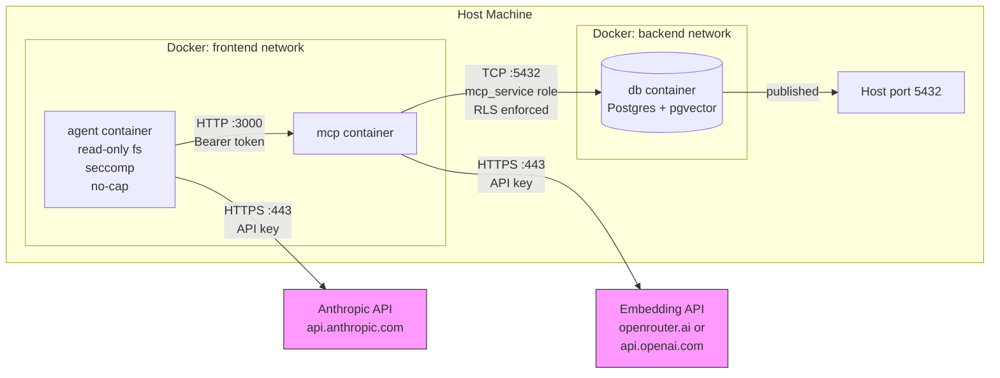

# Talos Security and Privacy Posture

This document is the single authoritative source for the security and privacy posture of the Talos platform. It is intended for operators evaluating the platform before deployment.

---

## 1. Threat Model and Attack Surfaces

### 1.1 Agent Escape

**Description:** The agent container attempts to access the host filesystem, spawn privileged processes, or break out of its sandbox.

**Mitigations in place:**

- Read-only root filesystem (`read_only: true`)
- All Linux capabilities dropped (`cap_drop: ALL`)
- No new privileges flag (`no-new-privileges:true`)
- Seccomp profile applied (`agent/seccomp-standard.json`, based on Docker default v28.0.1)
- Writable paths limited to tmpfs mounts (`/app/workspace`, `/tmp`)

**Residual risk:** The seccomp profile strength has not been independently verified against a hardened profile. The `agent-strict` profile (gVisor/runsc) requires manual host installation and no install verification exists.

### 1.2 MCP Injection

**Description:** A malicious agent sends crafted tool arguments to the MCP server to extract data belonging to other agents.

**Mitigations in place:**

- Row Level Security (RLS) enforced with `FORCE ROW LEVEL SECURITY` on `entries` and `audit_log` tables
- The `mcp_service` database role has only SELECT/INSERT/UPDATE/DELETE on its own rows, scoped by agent identity

**Residual risk:** RLS policies are only as strong as their WHERE clause implementation. A logic error in the policy could allow cross-agent reads.

### 1.3 Credential Leakage

**Description:** API keys or database passwords appear in container image layers, logs, or environment variable dumps.

**Mitigations in place:**

- Credentials are injected as Docker secrets (files at `/run/secrets/`), not as environment variables
- No secrets are hardcoded in `docker-compose.yml` defaults

**Residual risk:** Secrets are visible to any process inside the container via `/run/secrets/` file reads. A compromised process with filesystem access can read them.

### 1.4 Embedding Data Exfiltration

**Description:** Text content is sent to cloud embedding APIs without operator awareness or consent.

**Mitigations in place:**

- All embedding is owned by the MCP server; agents never call embedding providers directly
- The embedding provider is documented, configurable, and visible in environment configuration
- Ollama provides a fully local embedding option (`EMBEDDING_PROVIDER=ollama`)

**Residual risk:** When using cloud embedding (OpenRouter or OpenAI), text chunks are sent externally. No content filtering or redaction is applied before transmission.

### 1.5 Cross-Agent Data Access

**Description:** One agent attempts to read database rows belonging to another agent identity.

**Mitigations in place:**

- Each agent uses a separate bearer token for MCP authentication
- The MCP server extracts agent identity from the token and passes it to the database
- RLS policies restrict row access by `agent_id`

**Residual risk:** A compromised MCP server could bypass RLS by connecting with a different role or manipulating the agent identity.

### 1.6 DB Network Exposure

**Description:** The Postgres port is reachable from outside the Docker network.

**Mitigations in place:**

- The database container is on the `backend` network only (not `frontend`)
- The agent container cannot reach the database directly

**Residual risk:** The ports mapping `"${DB_PORT:-5432}:5432"` publishes Postgres to the host. Docker binds to `0.0.0.0` by default, exposing the port to all network interfaces unless the host firewall prevents it.

### 1.7 Dependency Chain Attacks

**Description:** Malicious npm packages in the agent or MCP container are executed at runtime.

**Mitigations in place:**

- No automatic `npm install` occurs at runtime; packages are installed at image build time from `package-lock.json`

**Residual risk:** npm supply chain attacks in transitive dependencies are not audited at build time. No integrity verification beyond the lockfile is performed.

---

## 2. Data Flow Diagram

### Network Topology

Talos uses two Docker networks to enforce isolation:

- **frontend network:** Contains the `agent` and `mcp` containers. The agent communicates with MCP over HTTP on port 3000 using bearer token authentication. The agent also has outbound internet access to reach the Anthropic LLM API (`api.anthropic.com:443`).
- **backend network:** Contains the `mcp` and `db` containers. Only MCP can reach the database. The agent container is not on this network and cannot connect to Postgres.

The MCP container bridges both networks: it receives tool calls from the agent on the frontend network and executes queries against Postgres on the backend network, using the restricted `mcp_service` role with RLS enforced.

**Finding:** The database port is published to the host via `"${DB_PORT:-5432}:5432"`. Docker binds this to `0.0.0.0` by default, making Postgres accessible on all host interfaces. For production deployments, bind to `127.0.0.1:5432:5432` or remove the port mapping entirely.

---

## 3. Security Guarantees

Each guarantee below is annotated with a `[CHECK: tag]` that maps to a verification function in `scripts/security-audit.sh`.

| Guarantee | CHECK Tag | How Verified |
|-----------|-----------|--------------|
| RLS enforced on entries table | `[CHECK: rls-entries]` | `SELECT rowsecurity FROM pg_tables WHERE tablename='entries'` returns `t` |
| RLS enforced on audit_log table | `[CHECK: rls-audit-log]` | `SELECT rowsecurity FROM pg_tables WHERE tablename='audit_log'` returns `t` |
| Non-superuser DB role for MCP | `[CHECK: mcp-role]` | `SELECT rolsuper FROM pg_roles WHERE rolname='mcp_service'` returns `f` |
| Agent cannot reach DB network | `[CHECK: agent-network-isolation]` | Agent container is not connected to the backend network |
| Agent rootfs is read-only | `[CHECK: agent-readonly-fs]` | `docker inspect` agent `HostConfig.ReadonlyRootfs` = `true` |
| Agent has no-new-privileges | `[CHECK: agent-no-new-privs]` | `docker inspect` agent `SecurityOpt` contains `no-new-privileges:true` |
| Agent has seccomp profile | `[CHECK: agent-seccomp]` | `docker inspect` agent `SecurityOpt` contains seccomp profile path |
| Agent capabilities dropped | `[CHECK: agent-cap-drop]` | `docker inspect` agent `CapDrop` contains `ALL` |
| Credentials as Docker secrets | `[CHECK: secrets-as-files]` | `/run/secrets/` directory exists inside mcp and agent containers |
| Agent resource limits enforced | `[CHECK: agent-resource-limits]` | `docker inspect` agent `HostConfig` `NanoCpus > 0` and `Memory > 0` |
| Audit trigger active | `[CHECK: audit-trigger]` | `audit_log` table exists and has rows after a write operation |
| MCP requires bearer token | `[CHECK: mcp-bearer-auth]` | Request without `Authorization` header returns HTTP 401 |

---

## 4. External Callout Inventory

Every network call that leaves a container is documented below. Operators can use this table to configure firewalls, evaluate data exposure, and plan air-gapped deployments.

| Container | Destination | Host | Port | Protocol | Purpose | Trigger | Data Sent | Optional | How to Disable |
|-----------|-------------|------|------|----------|---------|---------|-----------|----------|----------------|
| mcp | OpenRouter embedding | openrouter.ai | 443 | HTTPS | Embedding generation | Any insert or update tool call | Text content to embed (chunks <= CHUNK_SIZE chars) | Yes | Set `EMBEDDING_PROVIDER=ollama` |
| mcp | OpenAI embedding | api.openai.com | 443 | HTTPS | Embedding generation | Any insert or update tool call | Text content to embed (chunks <= CHUNK_SIZE chars) | Yes | Set `EMBEDDING_PROVIDER=ollama` |
| mcp | Ollama (local) | OLLAMA_BASE_URL (configurable) | configurable | HTTP | Local embedding generation | Any insert or update tool call | Text content to embed | No (self-hosted) | N/A -- this IS the local option |
| agent | Anthropic LLM | api.anthropic.com | 443 | HTTPS | LLM inference (reasoning + tool selection) | Every agent turn | Full conversation history, system prompt, tool definitions | Partial -- only Claude implemented; other providers could be added | No drop-in replacement implemented; requires code changes |
| agent | MCP server (internal) | mcp (Docker DNS) | 3000 | HTTP | Tool execution | Agent tool use blocks | Tool name + arguments | No -- required for agent function | N/A |

### What Is NOT Sent Externally

- Raw Postgres query results
- Database contents (only the text-to-embed is sent to embedding providers)
- Agent API keys or secrets
- Audit log data
- Conversation metadata outside the LLM API call

### Air-Gapped Operation

Set `EMBEDDING_PROVIDER=ollama` and configure `OLLAMA_BASE_URL` to point to a local Ollama instance. This eliminates all embedding-related external calls.

**Caveat:** No local LLM provider is implemented for the agent container. Only Anthropic (cloud) is available today. Fully air-gapped LLM inference requires a code addition to support a local provider.

---

## 5. Open Security Questions

These are unresolved assumptions. Deploy at your own risk until each is addressed. Resolved items are removed from this section.

**[RESOLVED] 1. DB port exposure** *(2026-04-22)*
Postgres is now bound to `127.0.0.1:${DB_PORT:-5432}:5432` in `docker-compose.yml` and `docker-compose.override.yml`. Other hosts on the LAN can no longer reach the database. The same treatment is applied to LibreChat (3080) in `docker-compose.yml` and MCP (3001) in `docker-compose.dev.yml`. Operators who need multi-machine access must change the binding explicitly and deploy behind a firewall / VPN.

**[BLOCKING] 2. Seccomp profile strength**
The seccomp profile (`agent/seccomp-standard.json`) is described as the Docker default v28.0.1 profile but has not been independently verified against a hardened or minimal profile. An audit comparing the allowed syscalls against actual agent requirements is needed.

**[BLOCKING] 3. gVisor availability**
The `agent-strict` sandbox profile specifies `runtime: runsc`, which requires gVisor to be installed on the host. No installation check or startup verification exists. If gVisor is absent, Docker will fail to start the container with an opaque error.

**[BLOCKING] 4. Anthropic embedding stub not disabled**
The file `mcp/src/providers/anthropic.ts` throws at runtime. An operator setting `EMBEDDING_PROVIDER=anthropic` will get a silent failure on the first embed call, not a startup error. This should either be removed or converted to a startup-time validation error.

**[BLOCKING] 5. Agent outbound not restricted**
The frontend Docker network has no egress filtering. The agent container can reach any internet host, not just `api.anthropic.com`. A compromised agent could exfiltrate data to arbitrary endpoints. Network policies or firewall rules should restrict outbound traffic to known API hosts.

**[BLOCKING] 6. MCP not TLS-terminated**
Communication between the agent and MCP containers uses plain HTTP on the frontend Docker network. This is acceptable for Docker-internal traffic under normal conditions, but if network segmentation fails or the frontend network is bridged to an external interface, traffic is unencrypted.

**[BLOCKING] 7. DB authentication state**
The `pg_hba.conf` configuration uses trust authentication for local connections. The exact final state of `pg_hba.conf` after all init scripts run has not been fully audited. An explicit audit of the authentication configuration is needed to confirm no unintended access paths exist.

---

## 6. Dev-only and Bypass Flags

Environment variables that intentionally weaken the posture for specific scenarios. Setting any of them in production widens the attack surface. The MCP server logs a `warn`-level line at startup when any of these flags is active, so the posture can be spot-checked in service logs.

**`MCP_SKIP_AUTH=true`** — bypasses bearer authentication for all requests. Bound to `docker-compose.dev.yml`. Intended only for local development where `0.0.0.0` host exposure is already prevented by the loopback port binding. Never set in production.

**`MCP_SKIP_AUTH_INTERNAL=true`** — set in `docker-compose.yml` for the MCP service. Allows requests that carry no `Authorization` header to be treated as `default-agent`. Relies on the `backend` Docker network being reachable only by co-located services (LibreChat). If MCP is ever exposed beyond that network, this flag creates an unauthenticated write surface. See the TODO in `mcp/src/auth.ts` — to be replaced with OAuth or mTLS before any external exposure.

**`ALLOW_ALL_DOMAINS=true`** — disables the fetch-tool domain allowlist. The fetch tool is an agent-callable capability; with the allowlist off, a compromised or runaway agent can be used as an SSRF probe or exfiltration channel. Use `ALLOWED_DOMAINS` (comma-separated) in production.

## 7. Other Documented Postures

These are intentional trade-offs documented here so they don't become surprises.

**VS Code webview CSP permits `style-src 'unsafe-inline'`.**
The viewer panel's Content-Security-Policy allows inline `<style>` blocks (required by React's `style={{...}}` prop and by Milkdown's inline style injection). `script-src` is nonce-only, `default-src` is `'none'`, and `connect-src` is not granted — so even if an attacker could inject inline styles, they could not exfiltrate. The blast radius is limited to visual disruption of the webview UI.

**VS Code webview → extension-host command invocation is allowlisted.**
The panel enables command URIs only for `talos.openEntry`, `talos.openWikilink`, and `talos.openTag`. The `invoke-command` bridge message on the extension host side enforces the same allowlist server-side — a compromised webview cannot dispatch arbitrary extension commands.

**Error messages are verbose.**
Tool responses include internal exception text (PRECONDITION_FAILED details, schema validation errors, etc.) to aid debugging. This is acceptable for a single-user system; a multi-tenant deployment would want to sanitize.

**No rate limiting on MCP.**
Any authenticated agent can issue unlimited request volume. A runaway or compromised agent can drive embedding-provider cost and DB load. Not a publication blocker for a single-user self-host; tracked in the roadmap backlog as a future ops-hardening phase.

**No outbound network restriction on agents.**
See [BLOCKING] 5 above. Agent containers can reach arbitrary internet hosts. A compromised agent is an exfiltration vector. Mitigate with host-level firewall rules or a network policy.
