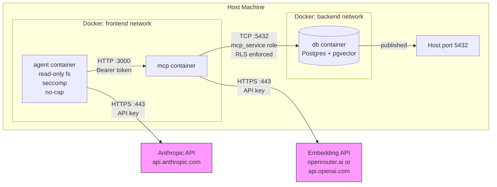

# Talos Security and Privacy Posture

This document is the single authoritative source for the security and privacy posture of the Talos platform. It is intended for operators evaluating the platform before deployment.

---

## 1. Threat Model and Attack Surfaces

### 1.1 Agent Escape

**Description:** The agent container attempts to access the host filesystem, spawn privileged processes, or break out of its sandbox.

**Mitigations in place:**

- Read-only root filesystem (`read_only: true`)
- All Linux capabilities dropped (`cap_drop: ALL`)
- No new privileges flag (`no-new-privileges:true`)
- Seccomp profile applied (`agent/seccomp-standard.json`, based on Docker default v28.0.1)
- Writable paths limited to tmpfs mounts (`/app/workspace`, `/tmp`)

**Residual risk:** The seccomp profile strength has not been independently verified against a hardened profile. The `agent-strict` profile (gVisor/runsc) requires manual host installation and no install verification exists.

### 1.2 MCP Injection

**Description:** A malicious agent sends crafted tool arguments to the MCP server to extract data belonging to other agents.

**Mitigations in place:**

- Row Level Security (RLS) enforced with `FORCE ROW LEVEL SECURITY` on `entries` and `audit_log` tables
- The `mcp_service` database role has only SELECT/INSERT/UPDATE/DELETE on its own rows, scoped by agent identity

**Residual risk:** RLS policies are only as strong as their WHERE clause implementation. A logic error in the policy could allow cross-agent reads.

### 1.3 Credential Leakage

**Description:** API keys or database passwords appear in container image layers, logs, or environment variable dumps.

**Mitigations in place:**

- Credentials are injected as Docker secrets (files at `/run/secrets/`), not as environment variables
- No secrets are hardcoded in `docker-compose.yml` defaults

**Residual risk:** Secrets are visible to any process inside the container via `/run/secrets/` file reads. A compromised process with filesystem access can read them.

### 1.4 Embedding Data Exfiltration

**Description:** Text content is sent to cloud embedding APIs without operator awareness or consent.

**Mitigations in place:**

- All embedding is owned by the MCP server; agents never call embedding providers directly
- The embedding provider is documented, configurable, and visible in environment configuration
- Ollama provides a fully local embedding option (`EMBEDDING_PROVIDER=ollama`)

**Residual risk:** When using cloud embedding (OpenRouter or OpenAI), text chunks are sent externally. No content filtering or redaction is applied before transmission.

### 1.5 Cross-Agent Data Access

**Description:** One agent attempts to read database rows belonging to another agent identity.

**Mitigations in place:**

- Each agent uses a separate bearer token for MCP authentication
- The MCP server extracts agent identity from the token and passes it to the database
- RLS policies restrict row access by `agent_id`

**Residual risk:** A compromised MCP server could bypass RLS by connecting with a different role or manipulating the agent identity.

### 1.6 DB Network Exposure

**Description:** The Postgres port is reachable from outside the Docker network.

**Mitigations in place:**

- The database container is on the `backend` network only (not `frontend`)
- The agent container cannot reach the database directly

**Residual risk:** The ports mapping `"${DB_PORT:-5432}:5432"` publishes Postgres to the host. Docker binds to `0.0.0.0` by default, exposing the port to all network interfaces unless the host firewall prevents it.

### 1.7 Dependency Chain Attacks

**Description:** Malicious npm packages in the agent or MCP container are executed at runtime.

**Mitigations in place:**

- No automatic `npm install` occurs at runtime; packages are installed at image build time from `package-lock.json`

**Residual risk:** npm supply chain attacks in transitive dependencies are not audited at build time. No integrity verification beyond the lockfile is performed.

---

## 2. Data Flow Diagram

### Network Topology

Talos uses two Docker networks to enforce isolation:

- **frontend network:** Contains the `agent` and `mcp` containers. The agent communicates with MCP over HTTP on port 3000 using bearer token authentication. The agent also has outbound internet access to reach the Anthropic LLM API (`api.anthropic.com:443`).
- **backend network:** Contains the `mcp` and `db` containers. Only MCP can reach the database. The agent container is not on this network and cannot connect to Postgres.

The MCP container bridges both networks: it receives tool calls from the agent on the frontend network and executes queries against Postgres on the backend network, using the restricted `mcp_service` role with RLS enforced.

**Finding:** The database port is published to the host via `"${DB_PORT:-5432}:5432"`. Docker binds this to `0.0.0.0` by default, making Postgres accessible on all host interfaces. For production deployments, bind to `127.0.0.1:5432:5432` or remove the port mapping entirely.
